# Preface

What drew me to Rithin Joseph’s work wasn’t just his academic rigor in behavioural forensics, but the rare way he sustains an **artistic life alongside scholarship**.

His films don’t feel like side projects or portfolio fillers—they feel like acts of necessity. The kind of cinema made not for algorithms, not for festivals, not for money, but because the story *had to exist*.

That integrity—being a criminologist who studies deception, memory, and human behaviour, while simultaneously making films that interrogate the same ideas emotionally—is something I deeply admire and consciously aspire to. That is what led me to analyse my favourite film of his: **AMY (2015)**.

If you’d like to see some of my earlier film-analysis work (before or after reading this), here are a few pieces I researched for the Indian film & music breakdown channel **[In Other Words](https://www.youtube.com/@Inotherwordsyt)**:

- **Research document:** [Rang De Basanti — Complete BGM & Soundtrack Analysis](https://docs.google.com/document/d/1Syk1a-8gzShUDDz8BEkDaI7bpQLVpXTJ8-26EomOElY/edit?usp=sharing)  
    → Resulted in this video: [A.R. Rahman’s GENIUS You MISSED in Rang De Basanti](https://youtu.be/iD_LIDKyyfQ)

- **Scene analysis:** [Badlapur — Opening Scene Analysis](https://docs.google.com/document/d/1pRNzr7agkg4LeQGv0fxeM1-s8rff4SdIgwPf1FYY_S8/edit?usp=sharing)  
    → Featured here: [Breakdown of Badlapur’s Iconic Opening](https://youtube.com/shorts/SujYjfQiWbY)

> I’m also currently building a platform called **Cinema Apparatus** — a Zettelkasten-style knowledge base for films, screenplays, interviews, visual essays, and analysis, with backlinks, graph view, and support for `.md` and `.fountain` files.  
> It’s still in development (and slightly buggy), but the live version is here:  
> **https://cinema-apparatus.netlify.app/**

---

# **AMY (2015) -  Short Film - Analysis**

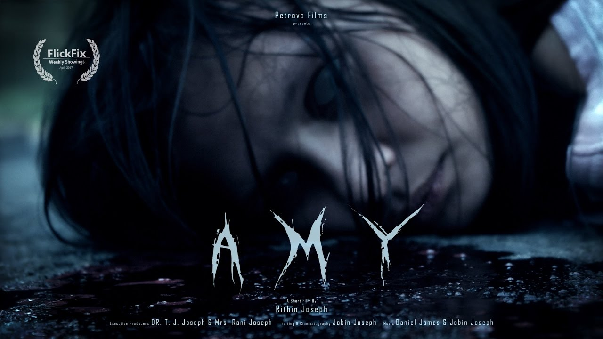

## Context & Authorship

* **Film:** *AMY* (Short Film, 2015)
* **Director / Writer / Actor:** Rithin Joseph
  → rare **auteur-style authorship** in Indian short cinema
* **Cinematography & Editing:** Jobin Joseph
* **Production Context:**

  * Made in 2015 — pre-Instagram-reels era, limited tutorials, limited indie VFX ecosystem
  * Explicit credit to **Film Riot (Ryan Connolly)** → clear lineage of learning-through-practice
* **Academic Subtext:**

  * NEHU credits → interesting overlap of campus, youth cinema, and DIY filmmaking cultures

*This already positions him as a self-taught, research-minded filmmaker — much like an academic.*

---

## Sound & Score (Affective Priming)

* Immediate **tonal anchoring through music**
* Score functions as:

  * **Emotional foreshadowing** rather than background accompaniment
  * Sets a *psychological thriller register* before narrative cues
* Use of silence + ambient sound:

  * Aligns with **Michel Chion’s theory of “empathetic sound”**
  * Sound design mirrors Dan’s internal anxiety
* Greatly captured on-set sounds (including panting, rubbing, groaning, and other awkward sounds), with the authentic location acoustics. Probably no ADR work done.

---

## Narrative Structure (Temporal Manipulation)

* **Non-linear opening**:

  * Film begins with what is later revealed as the *ending*
  * Classic **in medias res** with delayed causal clarity

| Beginning (setup) | Later (return) |
|:---:|:---:|
| 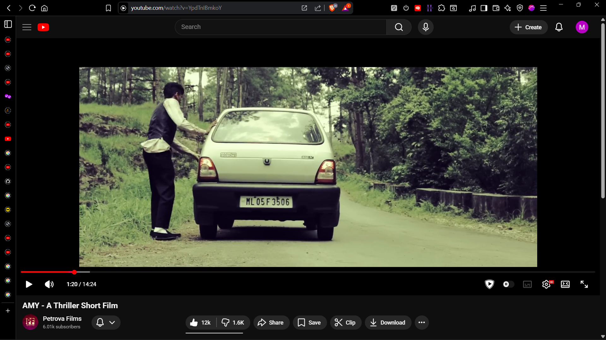 | 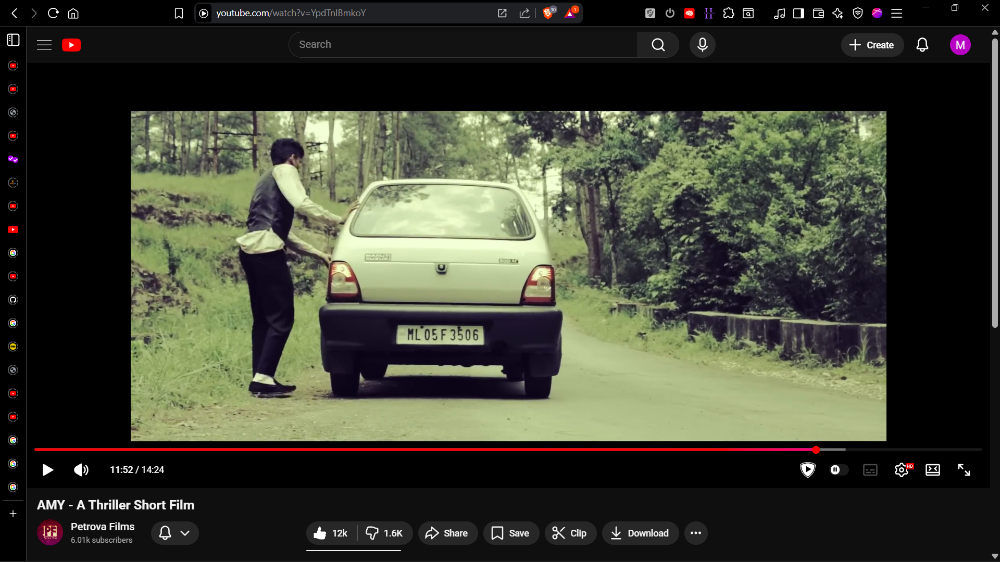 |

* Use of:

  * **Setup & payoff**
  * **Circular narrative loop**

| Payoff (reveal) |
|:---:|
| 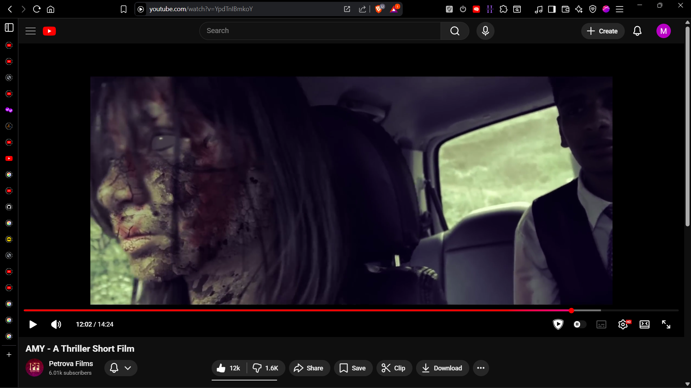 |

* The repetition at the end suggests:

  * Eternal punishment
  * Trauma loop
  * Moral recursion

The structure quietly echoes **Nietzschean eternal recurrence** — guilt repeating until acknowledged.

---

## Cinematography & Camera Language

* Predominantly **handheld camera**

  * Creates instability
  * Mirrors protagonist’s fractured mental state
* Deliberately “wrong” framing:

  * Negative space
  * Off-center compositions

| Eerie framing (feels as if someone's spying) |
|:---:|
| 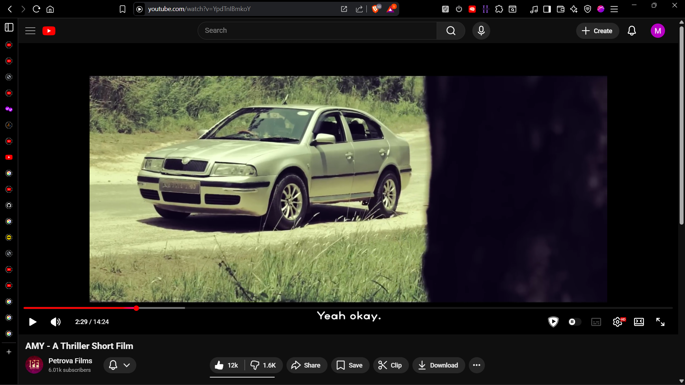 |

* Visual loneliness:

  * Abandoned roads
  * Empty landscapes
* Wheel illusion shot:

  * Shutter-speed sync illusion → physics-based uncanny visual
  * Subtle metaphor: *motion without moral progress*

Visual grammar here resembles:

* Early **Danny Boyle**
* Low-budget **David Fincher-esque psychological framing**
* Indie Malayalam thriller sensibilities

---

## Violence & Realism (Ethical Gaze)

* Violence is:

  * Sudden
  * Unromantic
  * Psychologically messy

| Unromantically stylized wound on Saurav's Head |
|:---:|
| 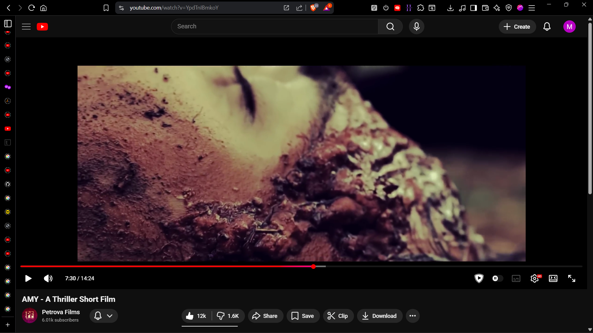 |

* Blood, wounds, body weight:

  * Not stylized
  * Feels **procedural**, almost forensic
* Dragging the body:

  * Hair pulling blood → tactile realism
  * Forces audience into **ethical discomfort**

This aligns with **anti-spectacle violence theory** (Susan Sontag-esque restraint).

---

## Acting & Embodied Psychology (Dan)

* Performance by Rithin Joseph:

  * Internalized guilt
  * Micro-expressions over dialogue

***Key moments:***

  * Pants slipping / unadjusted clothing → shock realism

| Slipped Pants (opposed to the initial jolly farewell party dress-up and mood) |
|:---:|
| 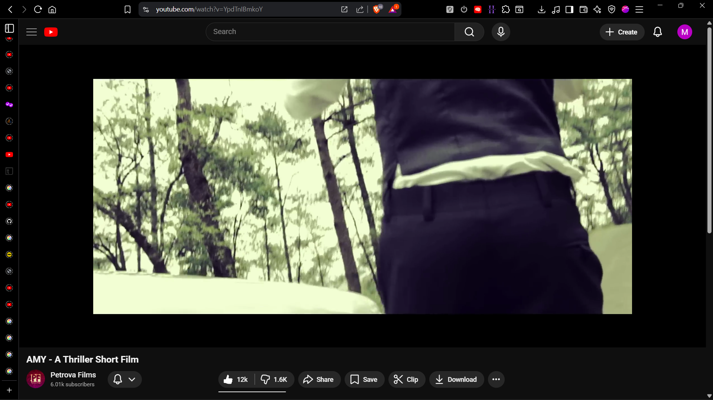 |

  * Spitting on the car:

    * Possible self-disgust
    * Externalization of moral contamination

| Spitting before attacking Saurav |
|:---:|
| 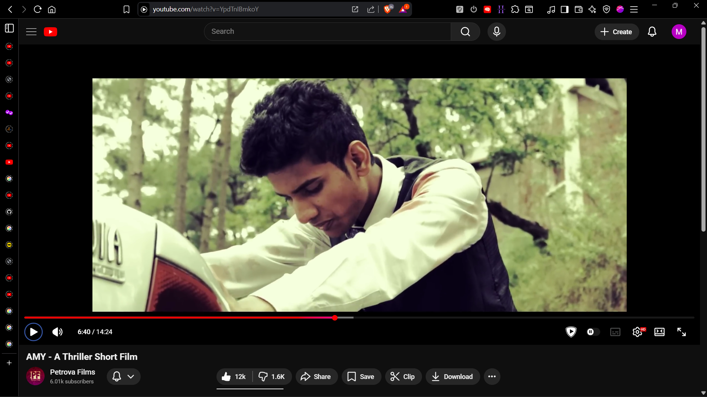 |

  * Crying after second murder:

    * Delayed emotional collapse
    * Suggests **cognitive dissonance breaking**

| Realistic cry depicting he messed up his life (he's a murderer now) |
|:---:|
| 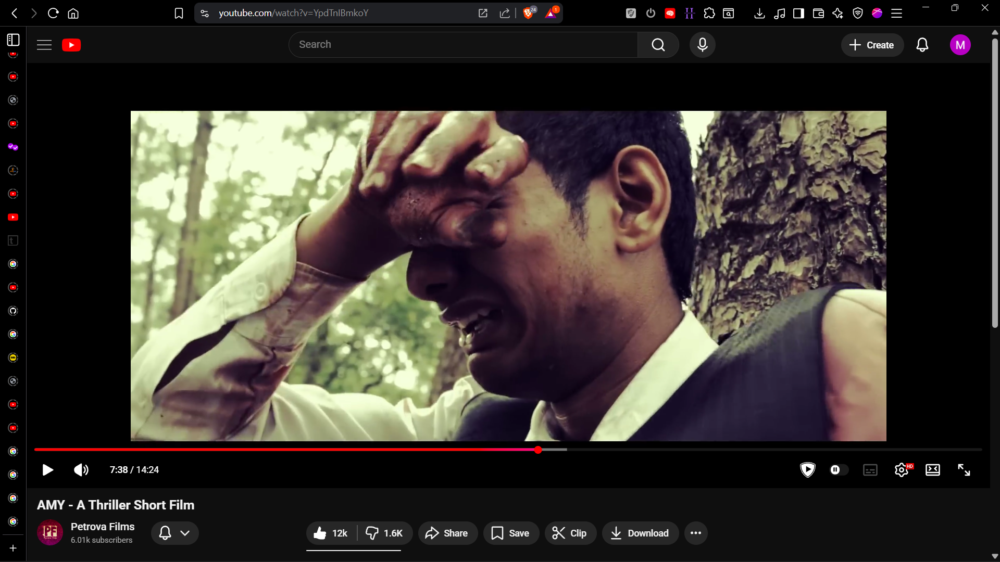 |

  * Realization of defeat:

    * He realizes that something is seriously wrong
    * Everything is going agaist him
    * Probably there's no escaping this chaos

| Standing still; lost |
|:---:|
|  |

This is **behavioural subtle acting**, not theatrical acting.

---

## Symbolism & Objects

* **White cloth**:

  * Attempt at moral “cleaning”
  * Fails (cloth remains, body disappears)

| Wrapped AMY in White Cloth | Later (only cloth remains) |
|:---:|:---:|
| 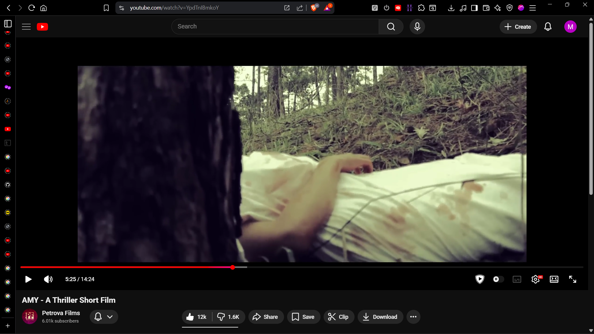 |  |

* **Tennis racket**:

  * Guilt artifact
  * Attempted disposal → failed erasure

| Taking racket out to throw it away far from Saurav's body |
|:---:|
| 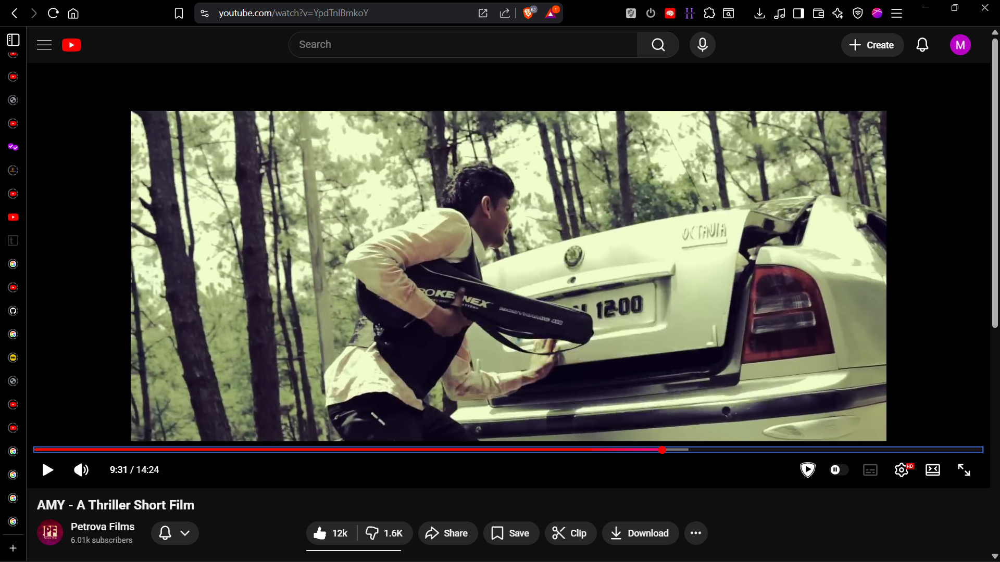 |

* **Unknown calls**:

  * Fate / conscience / inevitability

| Unknown call (start) | Unknown call (end - repeat) |
|:---:|:---:|
| 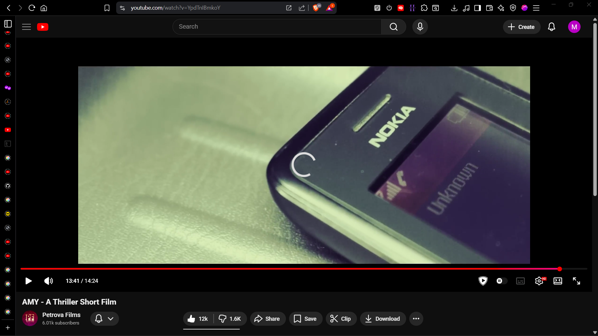 | 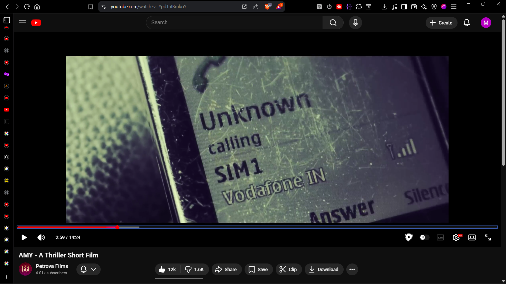 |

* **Car**:

  * Agency + escape
  * Ultimately betrays him

| Car betrayed him (now he is left with no hopes other than someone else saving him) |
|:---:|
| 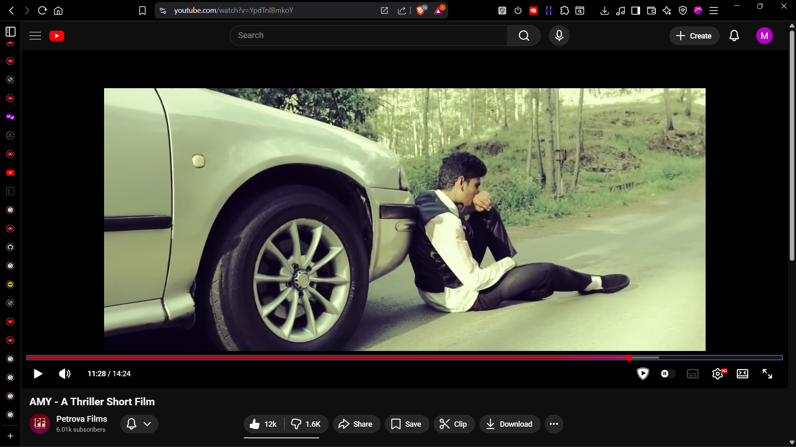 |

---

## Supernatural vs Psychological Reading

* Ghost Amy:

  * Can be read as:

    * Literal supernatural punishment
    * Hallucination born of guilt
    * Moral memory imprint
* The repetition ending:

  * Suggests **inescapability of guilt**
  * Crime reproduces itself

| THE END (credit rolls) |
|:---:|
| 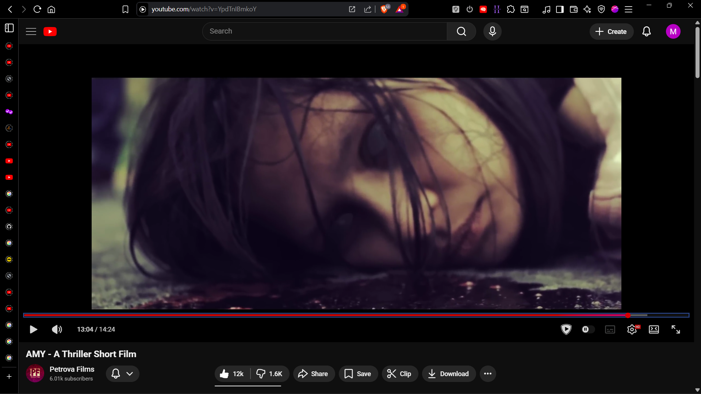 |

This ambiguity is the film’s strength.

---

## VFX & Technical Ingenuity

* Building removal:

  * Planar tracking (Mocha)
  * 3D camera tracking
* Purpose:

  * Not spectacle
  * Emotional isolation

| VFX by Jobin Joseph |
|:---:|
| 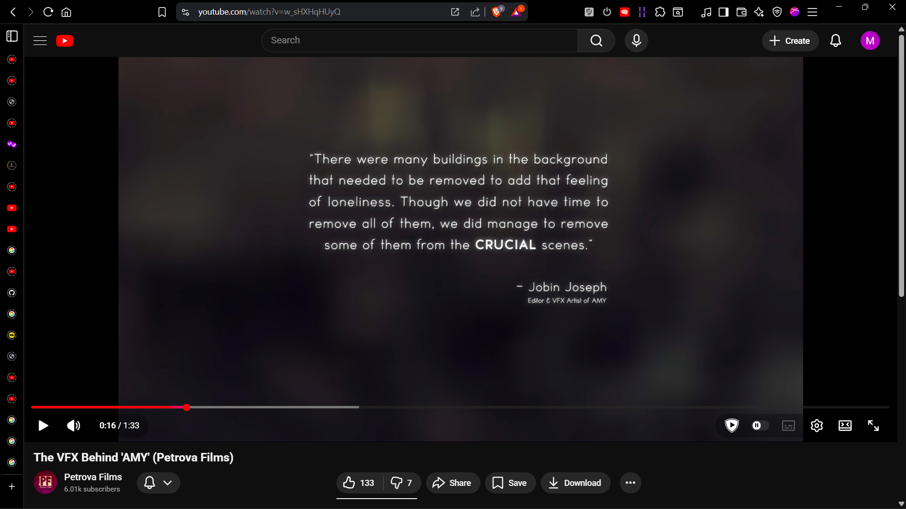 |

* Title reveal:

  * Motion-tracked typography integrated into diegesis

| Petrova Films | AMY (title drop) |
|:---:|:---:|
| 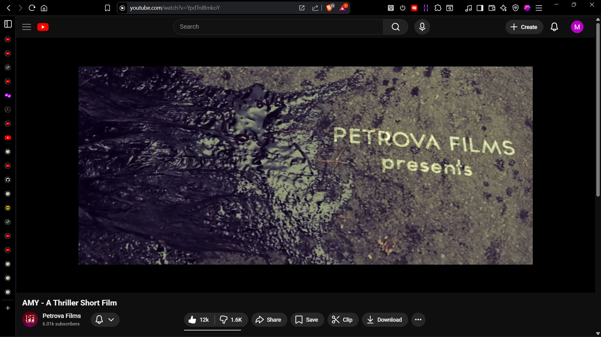 | 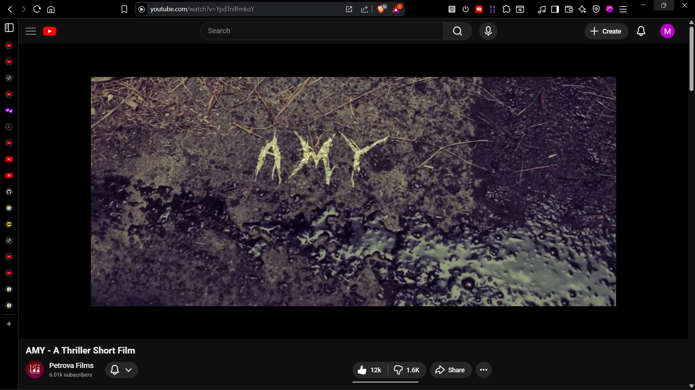 |

* Credits typography morphing:

  * Rare care for **post-narrative aesthetics**
  * Signals filmmaker’s obsession with form

This is **process-driven VFX**, not decorative VFX.

---

## Thematic Core (Why AMY matters)

* Guilt ≠ punishment
* Memory ≠ escape
* Witnessing ≠ absolution
* Crime repeats when conscience is avoided

<!-- This **directly resonates with behavioural forensics**, and memory-based guilt frameworks.  -->
AMY studies **behaviour under moral stress**
